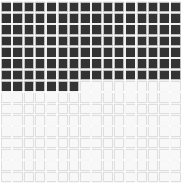
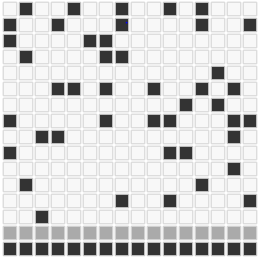
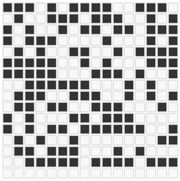
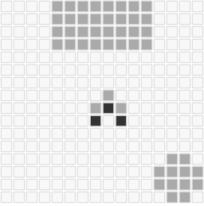

miniconsole
===========
doc:
```javascript
void miniconsole.draw();
void miniconsole.update();
void miniconsole.video.set(x, y, array );
boolean miniconsole.input.iskeydown( key_name );
boolean miniconsole.input.istouch( x, y, w, h );
boolean miniconsole.input.click( x, y, w, h );
void miniconsole.setFPS( fps );
```

examples:

Inicializing
```javascript
// amount of cells in width & height
miniconsole.video.w = 16;
miniconsole.video.h = 16;

// cells width & height
miniconsole.video.cell_w = 16;
miniconsole.video.cell_h = 16;

// 60 photos por second
miniconsole.setFPS( 60 );

// on load, start!
window.onload = function(){
	miniconsole.show( new MyGame() );
};
```

A game function struct
```javascript
function MyGame(){
	var a_game = {};
	
	a_game.update = function(){
		// TO DO update logic here
	};
	
	a_game.draw = function(){
		// TO DO draw logic here
	};
	
	return a_game;
}
```

Drawing a simple array:
```javascript
miniconsole.video.set( 0, 0, [1, 0, 2] );
```


Drawing a double array:
```javascript
miniconsole.video.set( 0, 0,
[
  [0,2,0],
  [2,2,2],
  [1,0,1],
]);
```


random outs:




